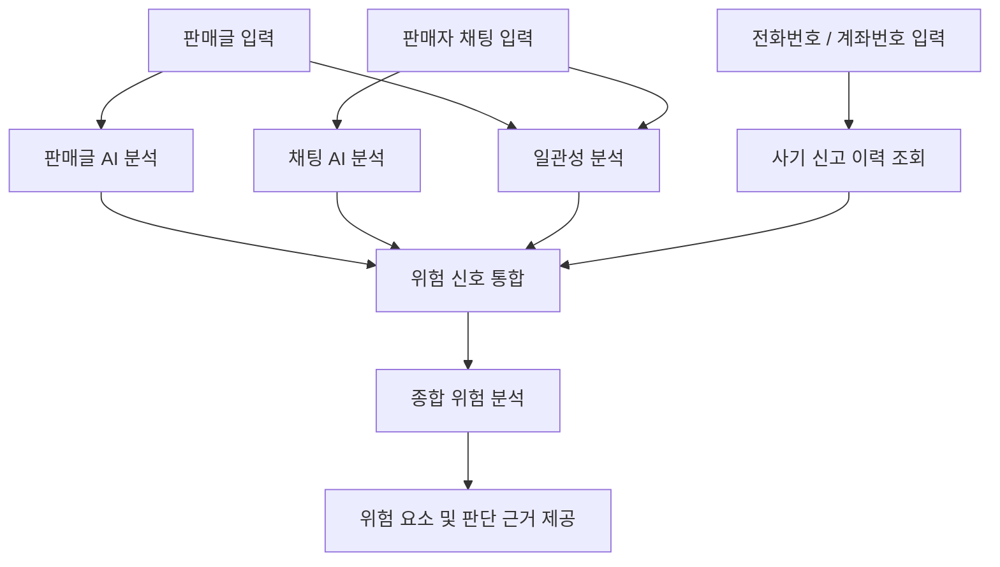

# Trust404 🔍

### 거래하기 전에, AI에게 한 번 더 확인하세요.

**Trust404**는 판매글, 판매자와의 채팅, 사기 신고 이력을 함께 분석하여  
중고거래 과정에서 나타나는 **사기 위험 신호와 판단 근거를 제공하는 AI 기반 서비스**입니다.

> 🏆 Wanted AI Championship 2026 출품작

[🌐 Trust404 서비스 체험하기](https://trust404.vercel.app)

---

## 💡 Why Trust404?

중고거래에서 구매자는 보통 송금하기 전에 판매자가 안전한 사람인지 판단해야 합니다.

기존의 사기 조회 서비스는 주로 **전화번호나 계좌번호의 과거 신고 이력**을 확인합니다.

하지만,

- 아직 신고되지 않은 판매자
- 새로운 전화번호나 계좌번호를 사용하는 판매자
- 신고 이력은 없지만 의심스러운 거래 행동을 보이는 판매자

의 경우 신고 이력만으로는 위험을 판단하기 어렵습니다.

Trust404는 여기서 한 단계 더 나아가  
**판매글과 실제 채팅 내용을 AI가 함께 분석**합니다.

---

## 🚨 Problem

중고거래 사기는 송금 이후 피해를 되돌리기 어렵지만,  
거래 과정에서는 여러 위험 신호가 나타날 수 있습니다.

예를 들면 다음과 같습니다.

- 선입금 요구
- 지속적인 입금 재촉
- 안전결제 거부
- 외부 메신저 이동 유도
- 비정상적으로 저렴한 가격
- 거래 방식의 갑작스러운 변경
- 판매글과 실제 대화 내용의 불일치

문제는 이런 위험 신호가 여러 문장과 메시지에 흩어져 있어  
사용자가 직접 종합하여 판단하기 어렵다는 점입니다.

Trust404는 이를 AI로 분석하여  
**송금 전에 사용자가 위험 요소를 확인할 수 있도록 돕습니다.**

---

# ✨ Key Features

## 1. 🔎 사기 신고 이력 조회

판매자의 전화번호 또는 계좌번호를 기반으로  
기존 사기 신고 이력을 확인합니다.

신고 이력이 존재하는 경우 AI 분석 결과와 함께  
거래 위험 판단을 위한 정보로 제공합니다.

---

## 2. 💬 채팅 AI 분석

판매자와 나눈 채팅 내용을 AI가 분석하여  
중고거래 사기 과정에서 나타날 수 있는 패턴을 탐지합니다.

### 주요 탐지 패턴

- 선입금 유도
- 입금 재촉
- 안전결제 거부
- 외부 메신저 이동 유도
- 비정상적인 거래 조건
- 거래 과정에서의 압박성 표현
- 질문 회피 및 조건 변경

---

## 3. 📝 판매글 AI 분석

판매글의 제목, 가격, 설명, 거래 조건 등을 분석하여  
거래 전 확인이 필요한 위험 요소를 탐지합니다.

단순 키워드 검색이 아니라  
**판매글 전체 문맥을 바탕으로 위험 신호를 분석**합니다.

---

## 4. 🔄 판매글 ↔ 채팅 일관성 분석

판매글에 작성된 조건과  
실제 판매자가 채팅에서 말한 내용을 비교합니다.

예를 들어,

```text
[판매글]
"서울 직거래 가능합니다."

        ↓

[실제 채팅]
"직거래는 어렵고 택배만 가능합니다."
```

처럼 거래 조건이 바뀌거나 서로 모순되는 경우  
이를 별도의 위험 신호로 탐지합니다.

---

## 5. ⚠️ 종합 거래 위험 분석

Trust404는 하나의 정보만으로 거래 위험을 판단하지 않습니다.

```text
전화번호 / 계좌번호 신고 이력
               +
          판매글 분석
               +
           채팅 분석
               +
     판매글 ↔ 채팅 일관성
               ↓
        종합 위험 분석
               ↓
      위험 요소 및 근거 제공
```

여러 분석 결과를 결합하여  
사용자가 거래 상황을 한눈에 확인할 수 있도록 제공합니다.

---

## 6. 🧠 Explainable Result

Trust404는 단순히

> "위험한 거래입니다."

라고만 알려주지 않습니다.

AI가 탐지한 **구체적인 위험 요소와 판단 근거**를 함께 제공합니다.

```text
⚠️ 주의가 필요한 거래입니다.

탐지된 위험 신호

• 판매자가 안전결제를 거부하고 있습니다.
• 계좌이체를 반복적으로 재촉하고 있습니다.
• 판매글에서는 직거래가 가능하다고 했지만
  채팅에서는 택배 거래만 요구하고 있습니다.

거래 전 추가 확인을 권장합니다.
```

Trust404의 목적은 AI가 거래 여부를 대신 결정하는 것이 아니라,  
**사용자가 판단할 수 있는 근거를 제공하는 것**입니다.

---

# 🤖 AI System

Trust404의 AI 분석은 크게 세 단계로 구성됩니다.

### ① Individual Analysis

판매글과 채팅을 각각 분석하여  
개별 위험 신호를 추출합니다.

### ② Consistency Analysis

판매글과 채팅 내용을 함께 비교하여  
거래 조건 및 설명의 불일치를 탐지합니다.

### ③ Risk Aggregation

AI 분석 결과와 신고 이력 정보를 결합하여  
사용자에게 최종 위험 요소와 판단 근거를 제공합니다.

---

## 🧠 AI Analysis Pipeline



---

# 🧪 AI Evaluation

LLM의 응답을 그대로 사용하는 것에서 끝나지 않고,  
분석 결과의 안정성을 확인하기 위한 **평가 데이터와 테스트 과정**을 구성했습니다.

프로젝트 내 `data/evaluation` 디렉터리에서  
AI 분석 결과 검증을 위한 데이터를 관리합니다.

```text
data/
└── evaluation/
```

주요 평가 대상은 다음과 같습니다.

- 사기 의심 패턴 탐지 여부
- 정상 거래에 대한 과도한 위험 판정 여부
- 판매글과 채팅 간 불일치 탐지 여부
- 동일한 거래 상황에 대한 분석 일관성
- 사용자에게 제공되는 판단 근거의 적절성

이를 통해 단순히 LLM API를 호출하는 서비스가 아니라  
**AI 결과를 평가하고 개선하는 과정을 프로젝트에 포함**했습니다.

---

# 🛠 Tech Stack

## Frontend

- React
- JavaScript
- HTML
- CSS

## Backend

- Python
- REST API

## AI

- LLM-based Text Analysis
- Prompt Engineering
- Fraud Pattern Detection
- Context Analysis
- Consistency Analysis
- AI Evaluation

## Collaboration & Development

- Git
- GitHub

---

# 🏗 Project Structure

```text
Trust404/
│
├── frontend/
│   └── Web Frontend
│
├── backend/
│   └── API & AI Analysis
│
├── data/
│   └── evaluation/
│       └── AI Evaluation Data
│
├── docs/
│   └── Project Documentation
│
├── .github/
│   └── GitHub Configuration
│
├── .gitignore
└── README.md
```

---

# 👥 Team

Trust404는 **2인 팀 프로젝트**로 진행했습니다.

두 팀원 모두 AI 직무를 목표로 하되,  
각자 다른 AI 개발 영역을 중심으로 담당했습니다.

| Member                                        | Main Role                            | Responsibilities                                                 |
| --------------------------------------------- | ------------------------------------ | ---------------------------------------------------------------- |
| [Lee-TaeGeon](https://github.com/Lee-TaeGeon) | AI Analysis / Backend                | AI 분석 로직, 위험 패턴 분석, API 연동, Backend 구현             |
| [Hramm22](https://github.com/Hramm22)         | AI Consistency / Service Integration | 판매글-채팅 일관성 분석, AI 결과 구조화, Frontend 및 서비스 연동 |

### 공동 작업

- 서비스 기획
- AI 분석 기준 설계
- Prompt 개선
- AI 결과 테스트
- 위험 판단 UX 설계
- 배포 및 통합 테스트

---

# 📷 Screenshots

## Main

<!--

-->

## 거래 정보 입력

<!--

-->

## AI 분석 결과

<!--

-->

## 위험 요소 상세 분석

<!--

-->

---

# 🌐 Demo

### Trust404

👉 **[서비스 바로가기](https://trust404.vercel.app)**

별도의 개발 환경 구축 없이  
배포된 웹 서비스에서 Trust404의 핵심 기능을 직접 체험할 수 있습니다.

---

# 🎯 Our Goal

Trust404는 AI가 사용자를 대신하여

> **"이 판매자는 사기꾼입니다."**

라고 단정하는 서비스를 목표로 하지 않습니다.

대신,

> **"현재 거래에서 어떤 위험 신호가 나타나고 있는가?"**

를 설명하는 것을 목표로 합니다.

신고 이력과 AI 분석을 결합하여  
사용자가 송금하기 전에 한 번 더 거래를 확인하고  
보다 많은 정보를 바탕으로 거래 여부를 판단할 수 있도록 돕습니다.

---

# 🏆 Wanted AI Championship 2026

Trust404는 **Wanted AI Championship 2026**을 위해 제작했습니다.

### Project

**Trust404 — AI 기반 중고거래 사기 위험 분석 서비스**

### Keywords

`AI` `LLM` `Fraud Detection` `Prompt Engineering`  
`Consistency Analysis` `React` `Python`
